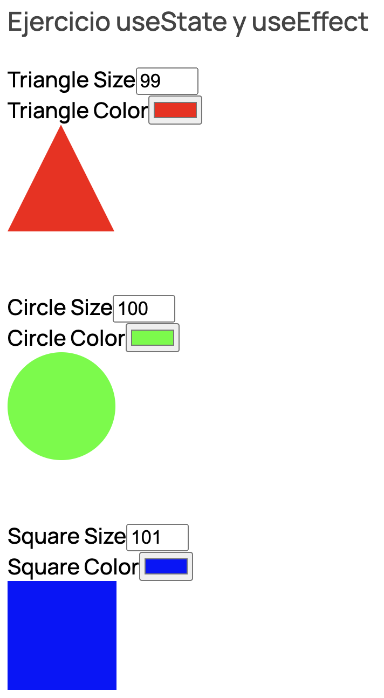

# Módulo 2: Introducción y Setup

Aplicación realizada con **React + Vite** donde se representa tres figuras geométricas con las posibilidad de controlar el color y el tamaño de cada forma de manera interactiva por el usuario. Cuando el color o el tamaño de las 3 figuras es el mismo se lanza una alerta.  
 

### Instrucciones

1. Instalación de dependencias: `npm i`
2. Ejecución de la aplicación: `npm run dev`

### [CodeSandBox](https://codesandbox.io/p/github/eliashz/ReactAvanzado-Modulo2/draft/determined-gianmarco)

### Documentación

- [Vite](https://es.vitejs.dev/guide/)
- [Estructura de archivos en React](https://es.reactjs.org/docs/faq-structure.html)
- [Atomic Design](https://bradfrost.com/blog/post/atomic-web-design/)  
   
  
- Design system  
   
  
- [ESLint](https://eslint.org/)
  - [eslint-config-airbnb](https://www.npmjs.com/package/eslint-config-airbnb): `npx install-peerdeps --dev eslint-config-airbnb`
