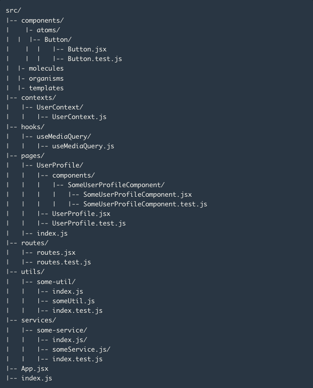

# Módulo 2: Introducción y Setup
### Instrucciones
1. Instalación de dependencias: `npm i`
2. Ejecución de la aplicación: `npm run dev`

### Documentación
* [Vite](https://es.vitejs.dev/guide/)
* [Estructura de archivos en React](https://es.reactjs.org/docs/faq-structure.html) 
* [Atomic Design](https://bradfrost.com/blog/post/atomic-web-design/)  
    
* [ESLint](https://eslint.org/)
* [eslint-config-airbnb](https://www.npmjs.com/package/eslint-config-airbnb): `npx install-peerdeps --dev eslint-config-airbnb`